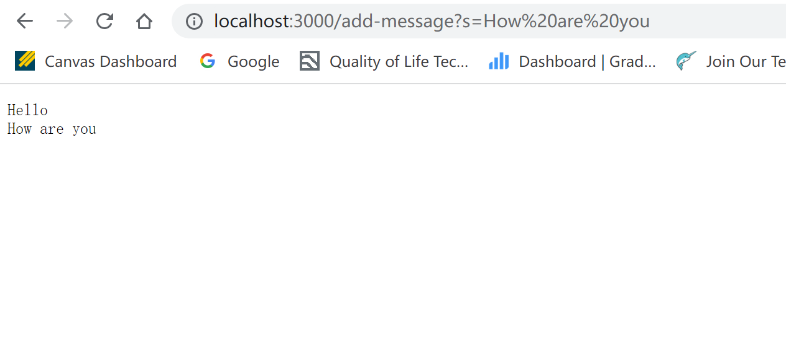

# A Simple Showcase of playing with Servers and Bugs at CSE 15L
This report aims to have a showcase about the topics of Servers and Bugs, covered in CSE15L at Week2 to Week3. There're mainly two parts, the first one (Part 1) discussed a technical example of implementing web server; the second one (Part 2) provides a case of the "pipeline" for bugs and debugging. An extra place (Part 3) is set to offer some personal comments of the lab experience by the author.

## Part 1
This practice goes based on the *NumberServer.java* and *Server.java* in lab activities, and re-implements the *URLHandler* interface as *Handler* class to achieve a brand new web server called `StringServer`.

### Server Implementation
Below attached the codes for the revised handler. Compared with the original one for numbers, the structure is **eased** to accomodate a simpler and clearer logic, that it handles the following cases of requests
1. `/add-message?s=<string>`: concatenate a new line the requested string to the current running string, and display the running string.
2. `/`: Display the running string. Note the author deviates from the lab instruction to add this case, because usually a user will not directly have a request, they will instead go to kind of "home page" first, then do something. To accomodate this mute habit, the author added this case (initially displaying a white board) to prevent error happening.
3. Other: other requests would trigger a "404 Not Found!" to let the user know they're off the track.

```
class Handler implements URLHandler {
    // The one bit of state on the server: a number that will be manipulated by
    // various requests.
    String s = "";

    public String handleRequest(URI url) {
        if (url.getPath().equals("/")) {
            return s;  // show a whiteboard or current string when input nothing
        } else {
            if (url.getPath().contains("/add-message")) {
                String[] parameters = url.getQuery().split("=");
                if (parameters[0].equals("s")) {
                    s += parameters[1];
                    s += "\n"; // accumulate s
                    return (s);
                }
            }
            return "404 Not Found!";
        }
    }
}
```
Note this block of code is the only revision from the two files in lab activity, so for simplicity purpose the author didn't include other codes. Compared with the original number implementation, the author editted the code in a way replacing the instance variable as integer to be string. The logic is eased so that the `/increment` request is no longer available. Other edits are quite natural, following the syntax of Java.

### Running the Server
The author proposed a brief instruction regarding the steps of running the program and starting/playing with the server.
1. Check if *StringServer.java* and *Server.java* is ready in current directory. If not, either move the files or direct into the according folder. Also check if the `java` and `javac` commands are ready under current environment. To keep it clean, see more information [here](https://stevela-hn.github.io/cse15l-lab-reports/) in Lab Report one.
2. Run the following commands in order. The first one compiles the program while the second one run the program & start the server.
    ```
    javac Server.java StringServer.java
    ```
    ```
    java StringServer 4000
    ```
    Upon getting done, the terminal should output `Server Started! Visit http://localhost:4000` to indicate a successful running.
3. In a brower of local computer, open http://localhost:4000 to play with the server.

Quick Notes
- `4000` is a **port** that the web server runs on. It's not special, and feel free to pick others. It is an extra part of a URL that’s often used in development.
- `localhost` refers to the current computer.
- You will see an white-board after accessing the link. That's the "home page" the author mentioned in the implementation part.

### Exmaples of Executing the program/server
This section provides some try-outs and according explanations for the server we wrote.

- **Attempt 1**: Here I tested on the "normal functionality" of the web server; that I inputed some strings to see if the page outputs and accumulates as I expected.
```
/add-message?s=Hello
```
The page shows

```
/add-message?s=How are you
```
The page shows

