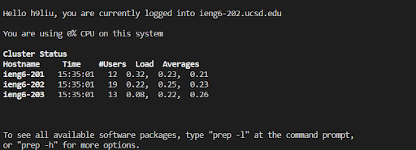

# Tutorial for Personalized Remote Access in CSE 15L

This is a tutorial for accessing remote server and operating file system of CSE15L at UCSD. Users are supposed to follow the steps below section by section. Note that this is working for mostly Windows users, as the author is not a Mac guy.

## Visual Studio Code Set-up
1. Download the Visual Studio Code ([recommended this website](https://code.visualstudio.com/)) if you haven't.
2. Open the software, and a panel like this will display. It might be in a different color or layout, but should be having a bar of (clickable) functionalities on the left.


## Remote Connection
1. We will need to activate bash in Visual Studio codes first.
   - Follow [this link](https://gitforwindows.org/) to get git bash installed in your computer.
   - Then strictly follow the top answer of [this post](https://stackoverflow.com/questions/42606837/how-do-i-use-bash-on-windows-from-the-visual-studio-code-integrated-terminal/50527994#50527994) to enable bash in your Visual Studio Code.
2. Then use the keyword `ssh` to do remote connecting
   - Open a new terminal by clicking **Terminal** -> **New Terminal** OR pressing keyboard shortcut ```Ctrl + Shift + ` ```.
   - In the terminal, connect to remote server by the command ```$ ssh [15L account username]@ieng6.ucsd.edu``` Note that you should be using your assigned CSE15L account username rather than the UCSD AD username here. But in the author's case, during his lab hours, there're some technical issues on the UCSD tech-support side. So (nearly) all students on that session had to use their UCSD AD username. This might lead to some permission denied issues in the following "command attempts" steps. So the author will be showing the working commands rather than all that was proposed. Upon successfully logging into the remote server, the terminal(bash) should have output like this


