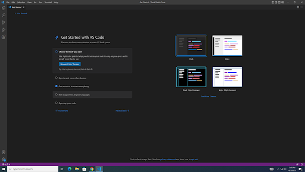

# Tutorial for Personalized Remote Access in CSE 15L

This is a tutorial for accessing remote server and operating file system of CSE15L at UCSD. Users are supposed to follow the steps below section by section. Note that this is working for mostly Windows users, as the author is not a Mac guy.

## Visual Studio Code Set-up
1. Download the Visual Studio Code ([recommended this website](https://code.visualstudio.com/)) if you haven't.
2. Open the software, and a panel like this will display. It might be in a different color or layout, but should be having a bar of (clickable) functionalities on the left.

## Remote Connection
1. We will need to activate bash in Visual Studio codes first.
   - Follow [this link](https://gitforwindows.org/) to get git bash installed in your computer.
   - Then strictly follow the top answer of [this post](https://stackoverflow.com/questions/42606837/how-do-i-use-bash-on-windows-from-the-visual-studio-code-integrated-terminal/50527994#50527994) to enable bash in your Visual Studio Code.
2. Then use the keyword `ssh` to do remote connecting
   - Open a new terminal by navigating **Terminal** -> **New Terminal** OR uing shortcut `Ctrl + Shift + "`" `
